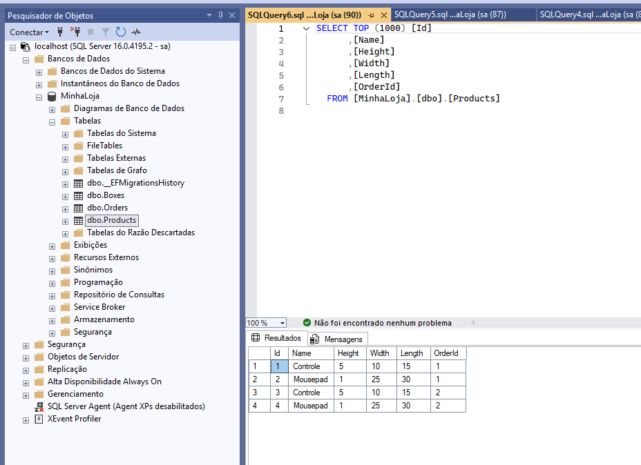
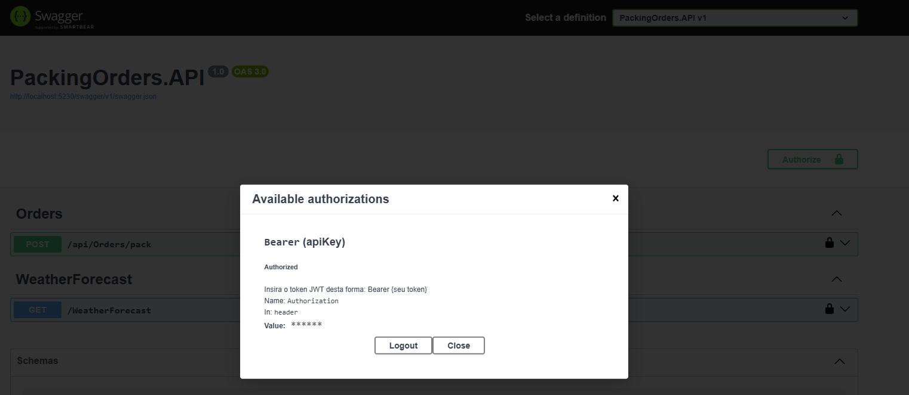
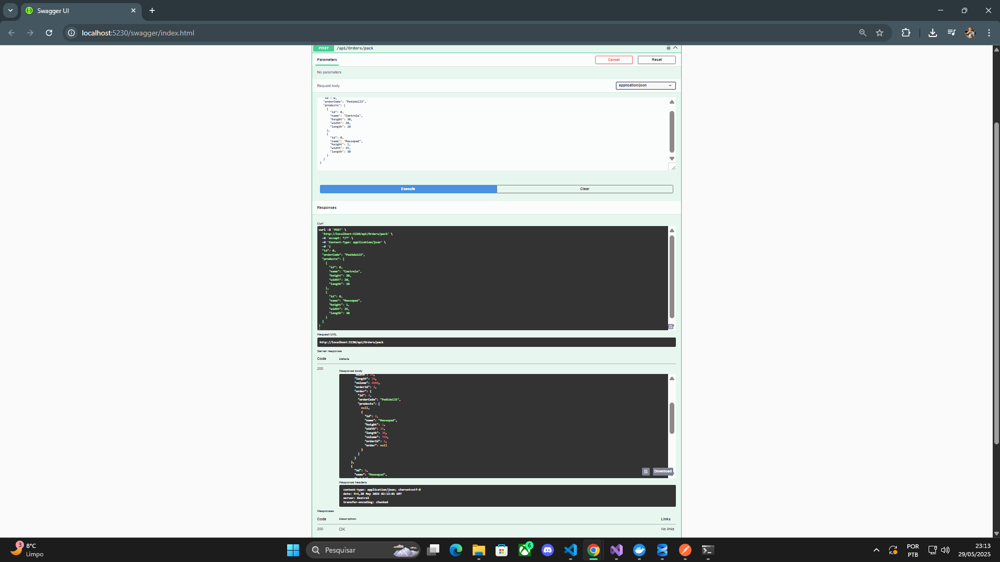
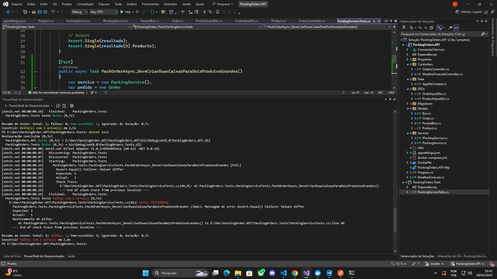

# Packing Orders API

API desenvolvida em **.NET 8/9** para empacotamento automático de pedidos, otimizando o uso de caixas pré-definidas com base nas dimensões dos produtos.  
Ideal para operações logísticas que precisam automatizar a seleção da melhor embalagem.

---

## 🔍 Visão Geral

Este projeto implementa um serviço que analisa as dimensões dos produtos de um pedido e retorna o melhor empacotamento em caixas disponíveis, visando otimização de espaço e redução de custos logísticos.  
Construído com foco em escalabilidade, testes automatizados e deploy simplificado via Docker.

---

## 🛠️ Tecnologias Utilizadas

- **.NET 8/9** com C# 11  
- xUnit para testes unitários  
- Docker e Docker Compose para containerização  
- CI/CD preparado para pipelines automatizados (ex: Azure DevOps, GitHub Actions)  
- Padrões de código modernos e suporte a Nullable Reference Types  
- Arquitetura modular com camadas de serviço e modelos separados  

---

## 📋 Requisitos

- [.NET SDK 8 ou 9](https://dotnet.microsoft.com/en-us/download)  
- [Docker](https://docs.docker.com/get-docker/) e [Docker Compose](https://docs.docker.com/compose/install/)  
- Git  

---

## 🚀 Como executar o projeto

### 1. Clone o repositório

```bash
git clone https://github.com/LucasLikes/PackingOrders.API.git
cd packing-orders-api
```

### 2. Suba os containers com Docker Compose

```bash
docker-compose up --build
```

### 3. Acesse a API no navegador

- Swagger UI: [http://localhost:5000/swagger](http://localhost:5000/swagger)  
- A API estará rodando na porta 5000 ou a definida no `docker-compose.yml`

---

## 📦 Lógica de Empacotamento

O sistema considera 3 tamanhos de caixas fixas:

- Caixa 1: 30 x 40 x 80  
- Caixa 2: 80 x 50 x 40  
- Caixa 3: 50 x 80 x 60  

Cada produto é comparado com essas caixas e alocado na menor caixa que comporta suas dimensões. Se não couber com outro produto, uma nova caixa é criada.

---

## 🔐 Autenticação (Opcional)

A API possui autenticação via JWT, protegendo os endpoints principais. Para obter o token:

1. Copie o token JWT da resposta.
3. No Swagger UI, clique em "Authorize" e insira o token no formato `Bearer {seu_token}`.

---

## 🧪 Testes Automatizados

Utilizei **xUnit** para validar a lógica de empacotamento. Exemplo de cenário testado:

- 2 produtos grandes => devem resultar em 2 caixas distintas.  
- 1 produto => apenas 1 caixa necessária.  

### Execução dos testes

```bash
dotnet test
```

#### Exemplo de saída com sucesso:

```bash
Test Run Successful.
Total tests: 2
Passed: 2
```

---

## 🖼️ Evidências Visuais

A pasta `/docs` contém prints para validação visual do funcionamento da aplicação:

1. 📦 Print do SSMS com a tabela `Products` populada.  
   

2. 🐳 Terminal mostrando os comandos `docker compose up` e `docker compose ps` em execução.  
   

3. 🔐 Tela de autenticação no Swagger UI exibindo a geração do token JWT.  
   

4. 📘 Tela do Swagger executando o endpoint principal com status `200 OK`.  
   

5. ✅ Print do teste unitário executado com sucesso no terminal.  
   


---

## 📁 Estrutura de Pastas (Simplificada)

```
PackingOrders.API/
├── Controllers/
├── Models/
├── Services/
├── Program.cs
├── appsettings.json
PackingOrders.Tests/
├── PackingServiceTests.cs
docker-compose.yml
README.md
```

---

## 📬 Contato

Caso tenha dúvidas ou queira falar sobre este projeto:  
**Lucas Gabriel Likes** – [LinkedIn](https://www.linkedin.com/in/lucas-gabriel-likes-06a2b9182/)

---

## ✅ Checklist de Requisitos

- [x] Microserviço em .NET Core rodando com SQL Server
- [x] Docker e Docker Compose configurados
- [x] Swagger configurado e funcional
- [x] Autenticação JWT implementada
- [x] Testes unitários automatizados com xUnit
- [x] README com prints e instruções

---
